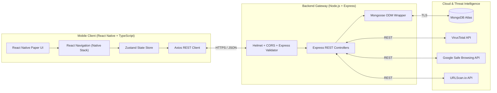
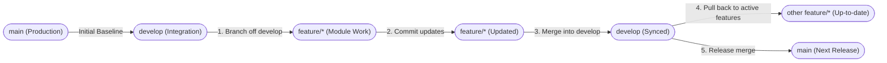

# Cyber Companion — Monorepo Architecture & Initialization Specification

> [!IMPORTANT]
> **Cyber Companion** is architected as a decoupled, production-grade monorepo separating the **React Native TypeScript Mobile Client** (`client/`) from the **Node.js + Express Threat Intelligence Gateway** (`server/`).

---

## 1. System Architecture & Data Flow



---

## 2. Monorepo Folder Hierarchy

```text
cyber-new/
├── .gitignore                        # Root Git exclusions (node_modules, .env, Android/Gradle builds, IDE caches)
├── ARCHITECTURE_INIT.md              # Architecture & operational runbook
├── client/                           # React Native (0.87.1) + TypeScript Mobile Application
│   ├── android/                      # Native Android Gradle project
│   ├── ios/                          # Native iOS Xcode project
│   ├── src/
│   │   ├── services/
│   │   │   └── api.ts                # Typed Axios HTTP gateway service
│   │   ├── store/
│   │   │   └── useSecurityStore.ts   # Typed Zustand global security state store
│   │   └── types/
│   │       └── security.ts           # Strict TypeScript domain & navigation contracts
│   ├── App.tsx                       # Root React Native component
│   ├── index.js                      # Metro bundler entry point
│   ├── package.json                  # Client dependencies & scripts
│   └── tsconfig.json                 # Strict TypeScript compiler configuration
└── server/                           # Node.js + Express Backend Gateway
    ├── src/
    │   ├── config/
    │   │   └── db.js                 # Asynchronous Mongoose connection wrapper for MongoDB Atlas
    │   ├── .env.example              # Template for required environment variables
    │   ├── app.js                    # Express middleware pipeline (Helmet, CORS, JSON parser, routes)
    │   └── server.js                 # HTTP server bootstrap & graceful shutdown handler
    ├── .env.example                  # Root server environment variable template
    └── package.json                  # Server dependencies & scripts
```

---

## 3. Installed Technology Stack

### Mobile Client (`client/`)
| Package | Purpose |
| :--- | :--- |
| `react-native` (`0.87.1`) & `typescript` | Core cross-platform mobile framework with strict static typing |
| `@react-navigation/native` & `@react-navigation/native-stack` | Native stack navigation container and screen routing |
| `react-native-screens` & `react-native-safe-area-context` | Native screen primitives and safe area boundary handling |
| `react-native-paper` & `react-native-vector-icons` | Material Design UI component library and iconography |
| `zustand` | Lightweight, hook-based global state management |
| `axios` | Promise-based HTTP client for communicating with the Backend Gateway |

### Backend Gateway (`server/`)
| Package | Purpose |
| :--- | :--- |
| `express` | REST API routing and middleware framework |
| `mongoose` | MongoDB object modeling and asynchronous Atlas connection management |
| `helmet` | HTTP response header hardening against XSS, clickjacking, and MIME sniffing |
| `cors` | Cross-Origin Resource Sharing policy enforcement |
| `dotenv` | Environment variable loading from `.env` |
| `axios` | Upstream HTTP requests to VirusTotal, Google Safe Browsing, and URLScan.io |
| `express-validator` | Request payload sanitization and schema validation |

---

## 4. Instructions to Run Both Services

### Step 1: Configure & Run the Backend Gateway (`server/`)

1. Navigate to the `server/` directory and create a `.env` file from `.env.example`:
   ```powershell
   cd server
   Copy-Item .env.example .env
   ```
2. Populate `.env` with your credentials:
   ```ini
   PORT=5000
   MONGODB_URI=mongodb+srv://<username>:<password>@cluster0.mongodb.net/cyber_companion?retryWrites=true&w=majority
   VIRUSTOTAL_API_KEY=your_virustotal_api_key_here
   SAFEBROWSING_API_KEY=your_google_safebrowsing_api_key_here
   URLSCAN_API_KEY=your_urlscan_io_api_key_here
   ```
3. Verify syntax and start the Express server:
   ```powershell
   # Validate syntax across all server modules
   npm run check

   # Start in development watch mode
   npm run dev

   # Or start in production mode
   npm start
   ```
4. Verify the gateway health endpoint at `http://localhost:5000/api/health`.

---

### Step 2: Typecheck & Run the Mobile Client (`client/`)

1. Navigate to the `client/` directory and verify TypeScript compilation:
   ```powershell
   cd client
   npm run typecheck
   ```
2. Start the Metro JavaScript bundler:
   ```powershell
   npm start
   ```
3. Launch the application on your target mobile platform (in a separate terminal inside `client/`):
   ```powershell
   # Run on Android Emulator or connected physical device
   npm run android

   # Run on iOS Simulator (macOS only)
   npm run ios
   ```

---

## 5. Git Branching & Version Control Model

- **Remote Repository**: `https://github.com/Anurag3215/Cyber-Companion-v2.git`
- **Default Production Branch**: `main` (stable, release-ready code only)
- **Active Integration Branch**: `develop` (central integration branch for all features)
- **Module Feature Branches** (branched from `develop`):
  - `feature/wifi-risk-analyzer`
  - `feature/url-scanner`
  - `feature/qr-scanner`
  - `feature/permission-analyzer`
  - `feature/security-score`
  - `feature/cyber-awareness`

### Branching & Synchronization Topology



### Standard Git Workflow Commands

1. **Start or switch to a feature branch (from `develop`)**:
   ```powershell
   git checkout develop
   git pull origin develop
   git checkout -b feature/<module-name>
   ```

2. **Merge feature updates into `develop`**:
   ```powershell
   git checkout develop
   git pull origin develop
   git merge --no-ff feature/<module-name> -m "feat(<module-name>): merge feature updates into develop"
   git push origin develop
   ```

3. **Pull updated `develop` changes back into other active `feature/*` branches**:
   ```powershell
   git checkout feature/<other-module>
   git merge develop -m "chore: sync latest develop into feature/<other-module>"
   git push origin feature/<other-module>
   ```

4. **Promote tested `develop` build to `main`**:
   ```powershell
   git checkout main
   git merge --no-ff develop -m "release: promote verified develop build to main"
   git push origin main
   ```

